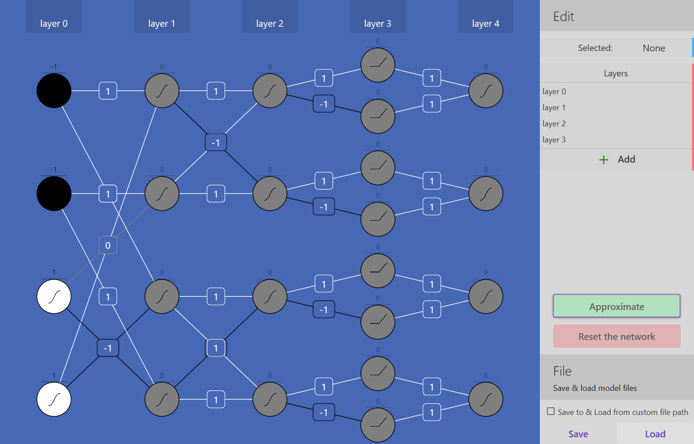
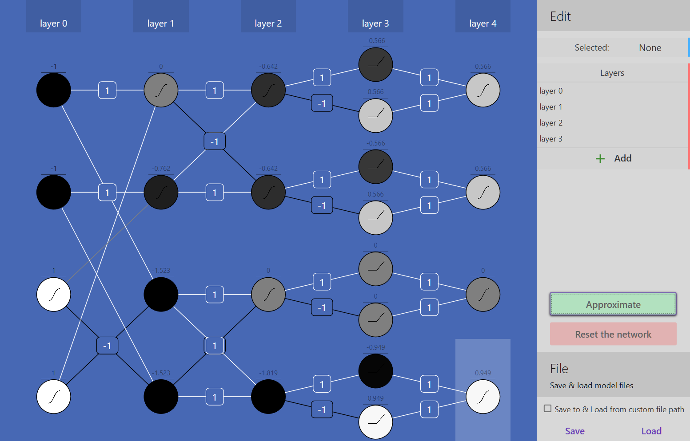

# simple-neural-net-model-editor
my OOP project  
This is an extremely simple neural net application (by simple I mean noob level, which I am..)  
Sometimes the code gets really dirty, but I had finishing my OOP project in time in mind so brace for impact if you gaze on my code, it might hurt :P)  
There is NO BACKPROPAGATION NO LEARNING NO NOTHING. yet.  
Have fun ^^  

